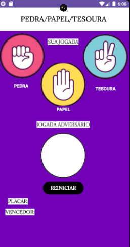

# jokenpo

<h1>SOBRE O PROJETO:</h1>

O projeto tem como propósito intensificar a aprendizagem de java, foi feito um jogo remoto de jokenpo o tão famoso pedra,papel ou tesoura,divertido e ainda fácil e rápido de programar ;

<h1>TELA DO PROJETO</h1>

  

